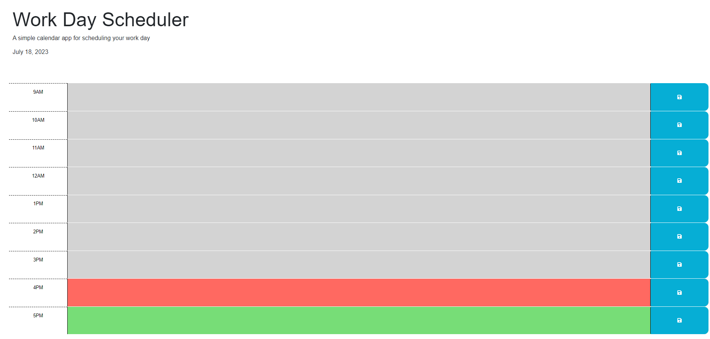

# Daily-Task-Tracker

 ## Table of Contents
  -[Description](#description)   
  -[Usage](#usage)   
  -[Screenshot](#screenshot)   
  -[Contribution](#contribution)  
  -[Additional Information](#additional-info)

  ## Description:
  A Workday planner to track items to do, broken down by time slots

  ## Usage:
  Clone the repository and open up index.html, or open live link to site (https://thinker92.github.io/Daily-Task-Tracker/) to start adding things to your schedule!

  ## Screenshot:
  

  ## Contribution:
  Create a GitHub issue for this repo (https://github.com/Thinker92/Daily-Task-Tracker.git) and/or send me an email! 
  

  ## Additional Information:
  - GitHub: [Thinker92](https://github.com/Thinker92)
  - Email: vilsonapo@gmail.com

  ## Author
  Vilson Apostolovski II
